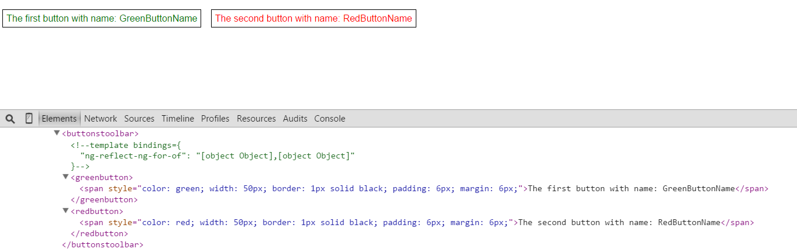

# angular2-dynamic-component

The implementation of dynamic component wrapper at Angular2 (RC5 compatible).

## Installation

First you need to install the npm module:
```sh
npm install angular2-dynamic-component --save
```

## Use case #1

**ButtonsToolbar.html**
```html
<template ngFor let-button [ngForOf]="buttons">
  <ButtonsToolbarPlaceholder [componentType]="button.type" [buttonName]="button.name">
  </ButtonsToolbarPlaceholder>
</template>
```

**ButtonsToolbar.ts**
```typescript
export interface ButtonType {
    name:string;
    type:{new ():IButton};
}

@Component({
    selector: 'ButtonsToolbar',
    template: require('./ButtonsToolbar.html'),
    directives: [
        ButtonsToolbarPlaceholder
    ],
})
export class ButtonsToolbar {

    buttons:Array<ButtonType> = [
        {
            name: 'GreenButtonName',
            type: GreenButton
        },
        {
            name: 'RedButtonName',
            type: RedButton
        }
    ];
}
```

**ButtonsToolbarPlaceholder.ts**
```typescript
import {DynamicComponent, DynamicComponentMetadata} from 'angular2-dynamic-component';

import {IButton} from './IButton';
import {ButtonType} from './ButtonsToolbar';

class ButtonsToolbarComponent extends DynamicComponentMetadata {

    constructor(public selector:string = 'ButtonsToolbarPlaceholder') {
        super();
    }
}

@Component(new ButtonsToolbarComponent())
export class ButtonsToolbarPlaceholder extends DynamicComponent<IButton> implements IButton {

    @Input() buttonName:string;
    @Input() componentType:{new ():IButton};
    
    protected destroyWrapper:boolean;

    constructor(...) {
        super(element, viewContainer, compiler, reflector, http);
        
        this.destroyWrapper = true;  // remove placeholder after,  because the component is not reset, and the data are not changed
    }
}
```

**IButton.ts**
```typescript
export interface IButton {
    buttonName:string;
}
```

**GreenButton.ts**
```typescript
@Component({
    selector: 'GreenButton',
    template: '<span style="color: green; width: 50px; border: 1px solid black; padding: 6px; margin: 6px;">The first button with name: {{ buttonName }}</span>',
})
export class GreenButton implements IButton {

    @Input() public buttonName:string;
}
```

**RedButton.ts**
```typescript
@Component({
    selector: 'RedButton',
    template: '<span style="color: red; width: 50px; border: 1px solid black; padding: 6px; margin: 6px;">The second button with name: {{ buttonName }}</span>',
})
export class RedButton implements IButton {
    @Input() public buttonName:string;
}
```

**Preview**


## Use case #2. Using the "componentTemplate" attribute
**app.ts**
```typescript
import {DynamicComponent} from 'angular2-dynamic-component';

@NgModule({
    entryComponents: [DynamicComponent],        // Angular2 RC5 compatible
    ...
})
...

@Component(...)
class App {
    private componentTemplate:string = '<input type="text" style="color: green; width: 100px;" [(ngModel)]="model" (ngModelChange)="onChange($event)"/>';
}
```

**app.html**
```html
<DynamicComponent [componentTemplate]="componentTemplate">
</DynamicComponent>
```

## Use case #3. Using the "componentMetaData" attribute
**app.ts**
```typescript
import {DynamicComponent} from 'angular2-dynamic-component';

@NgModule({
    entryComponents: [DynamicComponent],        // Angular2 RC5 compatible
    ...
})
...

@Component(...)
class App {
    public getDynamicMetaData():IComponentMetadata {
        return {
           ...
        };
    }
}
```

**app.html**
```html
<DynamicComponent [componentMetaData]="getDynamicMetaData()">
</DynamicComponent>
```

## Use case #4. Using the "componentTemplateUrl" attribute

The main feature is the support of [http 301](https://en.wikipedia.org/wiki/HTTP_301) and [http 302](https://en.wikipedia.org/wiki/HTTP_302) statuses.

**app.ts**
```typescript
import {DynamicComponent} from 'angular2-dynamic-component';

@NgModule({
    entryComponents: [DynamicComponent],        // Angular2 RC5 compatible
    ...
})
```

**app.html**
```html
<DynamicComponent [componentTemplateUrl]="'http://www.yandex.ru'">
</DynamicComponent>
```

## Publish

```sh
npm run deploy
```

## License

Licensed under MIT.